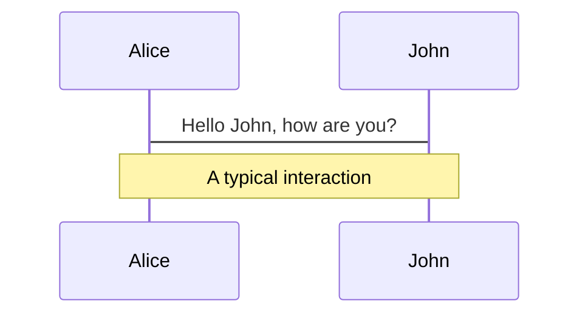
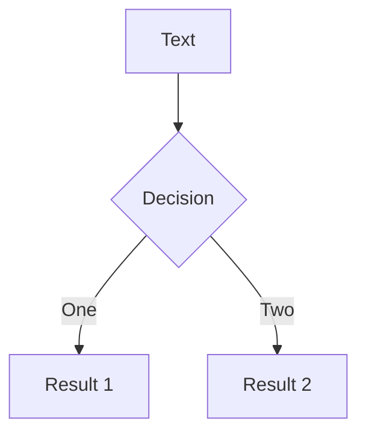
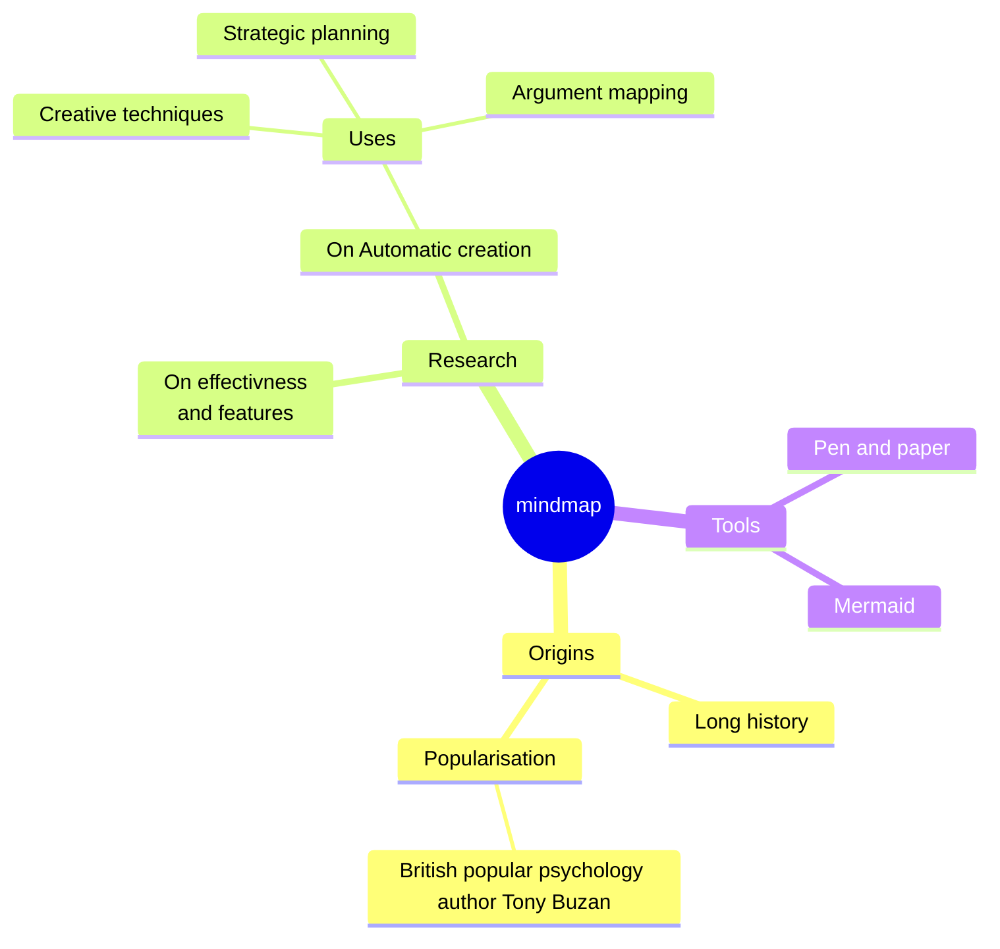
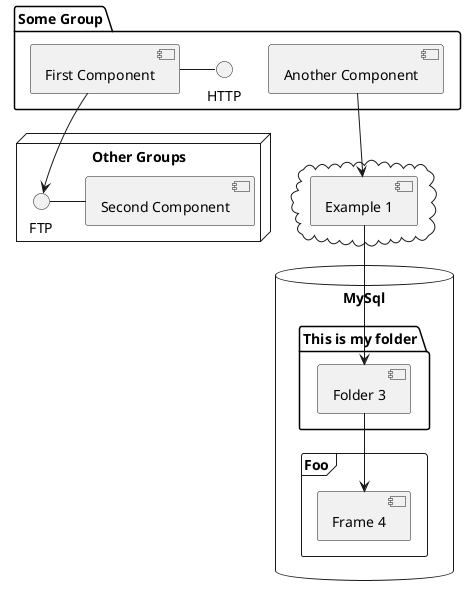

# EmberConf 2023

## Polaris is Coming

What is Polaris? And why does it matter?

<div class="pt-12">
  <span @click="$slidev.nav.next" class="px-2 py-1 rounded cursor-pointer" hover="bg-white bg-opacity-10">
    Press Space for next page <carbon:arrow-right class="inline"/>
  </span>
</div>

<div class="abs-br m-6 flex gap-2">
  <button @click="$slidev.nav.openInEditor()" title="Open in Editor" class="text-xl slidev-icon-btn opacity-50 !border-none !hover:text-white">
    <carbon:edit />
  </button>
  <a href="https://github.com/slidevjs/slidev" target="_blank" alt="GitHub"
    class="text-xl slidev-icon-btn opacity-50 !border-none !hover:text-white">
    <carbon-logo-github />
  </a>
</div>

<!--
The last comment block of each slide will be treated as slide notes. It will be visible and editable in Presenter Mode along with the slide. [Read more in the docs](https://sli.dev/guide/syntax.html#notes)
-->

---
transition: fade-out
layout: intro
---

# What we'll cover today {.fancy}

- 🌟 What will programming in Polaris look like?
- 💭 Why do we care about making Ember better?

<style>
  ul {
    display: grid;
    justify-items: start;
    justify-content: center;
    row-gap: var(--s-base);
  }
  li {
    list-style-type: none;
    font-size: var(--s-up3);
  }
</style>

---
layout: intro
---

# Big Picture

<v-clicks depth="2">

1. `<template>`
2. Routing
3. TypeScript
4. Modern Tooling By Default
    - vite out of the box 
    - vite plugins, optimized builds, etc. etc.
    - [**strong emphasis on zero-config shared tooling**]{.text-red}
{.fs-up3 .text-purple}

</v-clicks>

<style lang="scss">
  ol li code {
    color: inherit !important;
  }

  ol {
    display: grid;
    grid-template-columns: 1fr auto 1fr;
  }

  ol li  {
    --current-hue: var(--hue-polaris);
    color: var(--color-mid);

    text-align: left;
    grid-column: 2;
    font-size: var(--s-up4);

    &::marker {
      --current-hue: var(--hue-polaris);
      color: var(--color-normal);
    }
  }

  ol li li {
    color: revert;
  }
</style>

---
layout: section
---

# Why Is Ember Here

## Really: Why We're <u>Still</u> Here {v-click}

> <u>HINT:</u> It has something to do with our apps, which are also still here.
{.emphasize .header content="🔎" v-click}

<style>
  :deep(.section-grid) {
    grid-template-rows: 1fr 1fr max-content;
  }
</style>

---
layout: two-cols
clicks: 2
---

# `<template>` {.text-center}

::a::

### Octane Colocation {.not-prose .octane}

<TheConsole title="counter.ts">

```ts {all|5|none} {at:0}
import Component from '@glimmer/component';
import { tracked } from '@glimmer/tracking';

class Counter extends Component {
  @tracked count = 0; // [!code hl]
  increment = () => this.count++;
}
```

</TheConsole>

<TheConsole title="counter.hbs">

```hbs {none|none|all} {at:0}
<p>{{this.count}}</p>
<button {{on "click" this.increment}}>
  increment
</button>
```

</TheConsole>


::b::

### Polaris `<template>` {.not-prose .polaris}

<TheConsole title="counter.gjs">

```ts {all|5|8-12} {at:0}
import Component from '@glimmer/component';
import { tracked } from '@glimmer/tracking';

class Counter extends Component {
  @tracked accessor count = 0; // [!code hl]
  increment = () => this.count++; 

  <template> // [!code focus:4]
    <p>{{this.count}}</p>
    <button {{on "click" this.increment}}>
      increment
    </button>
  </template>
}
```

</TheConsole>

---
layout: text-code
---

# Inline Helpers

::a::

## Just write a function in the same file.

::b::

<TheConsole title="article.gjs">

```ts
<template>
  <h1>{{uppercase @title}}</h1>
  <div>{{@body}}</div>
</template>

function uppercase(string: string) {
  return string.toUpperCase();
}
```

</TheConsole>

---
layout: text-code
prose: small
---

# Extracting Into Another Module

::a::


### Named Exports Just Work™️

Just move the function to another file, import it as usual, and it Just Works.

The function signature is just a normal JavaScript signature too. {v-click}

And no need to wrap it in
`helper()` either. {v-click}

::b::


<TheConsole title="utils/uppercase.ts">

```ts
export function uppercase(string: string) {
  return string.toUpperCase();
}
```

</TheConsole>


<TheConsole title="article.gjs">

```ts
import { uppercase } from "./utils/uppercase";

<template>
  <h1>{{uppercase @title}}</h1>
  <div>{{@body}}</div>
</template>
```

</TheConsole>

---
layout: two-cols
kind: octane
clicks: 1
---

# Modifiers

### In Octane, Modifiers Go In Separate Files {.not-prose .octane}

::a::

<the-console v-click="0" title="my-component.hbs">

```hbs
<button {{move-randomly}}>
  {{yield}}
</button>
```

</the-console>

An example from the `ember-modifier` [docs]. {v-click=1}

[docs]: (https://github.com/ember-modifier/ember-modifier#example-with-cleanup)

::b::

<the-console v-click="1" title="app/modifiers/move-randomly.js">

```ts
import { modifier } from 'ember-modifier';
const { random, round } = Math;

export default modifier(element => {
  const id = setInterval(() => {
    const top = round(random() * 500);
    const left = round(random() * 500);
    element.style.transform = 
    `translate(${left}px, ${top}px)`;
  }, 1000);

  return () => clearInterval(id);
});
```

</the-console>

---
layout: text-code
code: small
prose: small
kind: polaris
---

# Inline Modifiers

### Polaris: Just Write a Modifier In the Same File {.not-prose .accent}

::a::

Now you can just write the modifier in the same file and use it directly!

And if you don't need any local state, you can just use a top-level `<template>`.

Pretty sweet! {.fs-up2}

::b::

<the-console title="my-component.gjs">

```ts {all|4,9}
import { modifier } from 'ember-modifier';

<template>
  <button {{moveRandomly}}>{{yield}}</button> // [!code hl]
</template>

const { random, round } = Math;

const moveRandomly = modifier(element => { // [!code hl]
  const id = setInterval(() => {
    const top = round(random() * 500);
    const left = round(random() * 500);
    element.style.transform = 
    `translate(${left}px, ${top}px)`;
  }, 1000);

  return () => clearInterval(id);
});
```

</the-console>


---
layout: two-cols
code: small
kind: polaris
clicks: 1
---

# Extracting Into Another Module

::a::


### It Just Works™️ {.polaris}

Just move the modifier to another file, import it as usual, and it Just Works.

Named exports work, just like functions, but so do default exports. {v-click}

::b::

<TheConsole title="my-component.gjs">

```ts {all|1} {at:0}
import moveRandomly from "./utils/move-randomly"; // [!code hl]

<template>
  <button {{moveRandomly}}>{{yield}}</button>
</template>
```

</TheConsole>

<TheConsole title="utils/move-randomly.ts">

```ts {all|3} {at:0}
import { modifier } from 'ember-modifier';

export default modifier(element => { // [!code hl]
  const id = setInterval(() => {
    const top = round(random() * 500);
    const left = round(random() * 500);
    element.style.transform = 
    `translate(${left}px, ${top}px)`;
  }, 1000);

  return () => clearInterval(id);
});
```

</TheConsole>


---
layout: two-cols
kind: polaris
---

# Multiple Components In One File

::a::

#### Like JSX... But With Template Syntax. {.polaris v-click="1"}
#### Like SFCs... But Multiple In One File. {.polaris v-click="2"}

> You can create multiple components in a single file, like React. {v-click="1"}

> But you can use template syntax, like Vue and Svelte. {v-click="2"}

> It's a unique combination that you can't get anywhere else. {v-click="3" .emphasize}

::b::

<TheConsole title="tabs.gjs">

```ts
<template>
  <Accordion @items={{@items}} as |accordion item|>
    <accordion.toggle>
      <Toggle @name={{item.name}} />
    </accordion.toggle>
    <accordion.panel>
      {{item.description}}
    </accordion.panel>
  </Accordion>
</template>

const Toggle = <template>
  <i class="fas fa-angle-right" />
  {{@name}}
</template>
```

</TheConsole>

---
layout: section
---

# Routing {.text-center}

Routing has been at the heart of Ember since Ember 1.0. {.text-center}

> At its core, Ember is a <u>web framework</u>, and good URL support is critical to web applications.
> {.emphasize .header content="🌐"}

<style>
  u {
    text-decoration: none;
    color: var(--color-accent-fg);
  }
</style>

---
layout: default
---

# What Does "Good URL Support" Mean?

---

# Navigation

Hover on the bottom-left corner to see the navigation's controls panel, [learn more](https://sli.dev/guide/navigation.html)

### Keyboard Shortcuts

|                                                    |                             |
| -------------------------------------------------- | --------------------------- |
| <kbd>right</kbd> / <kbd>space</kbd>                | next animation or slide     |
| <kbd>left</kbd> / <kbd>shift</kbd><kbd>space</kbd> | previous animation or slide |
| <kbd>up</kbd>                                      | previous slide              |
| <kbd>down</kbd>                                    | next slide                  |

<!-- https://sli.dev/guide/animations.html#click-animations -->


<p v-after class="absolute bottom-23 left-45 opacity-30 transform -rotate-10">Here!</p>

---
layout: image-right
image: https://source.unsplash.com/collection/94734566/1920x1080
---

# Code

Use code snippets and get the highlighting directly![^1]

```ts {all|2|1-6|9|all}
interface User {
  id: number;
  firstName: string;
  lastName: string;
  role: string;
}

<template>
  <h1>Hi</h1>
  {{#if (a hello) as |b|}}
    <b @c={{d}} />
  {{/if}}
</template>

function updateUser(id: number, update: User) {
  const user = getUser(id);
  const newUser = { ...user, ...update };
  saveUser(id, newUser);
}
```

<arrow v-click="3" x1="400" y1="420" x2="230" y2="330" color="#564" width="3" arrowSize="1" />

[^1]: [Learn More](https://sli.dev/guide/syntax.html#line-highlighting)

<style>
.footnotes-sep {
  @apply mt-20 opacity-10;
}
.footnotes {
  @apply text-sm opacity-75;
}
.footnote-backref {
  display: none;
}
</style>

---

# Components

<div grid="~ cols-2 gap-4">
<div>

You can use Vue components directly inside your slides.

We have provided a few built-in components like `<Tweet/>` and `<Youtube/>` that you can use directly. And adding your custom components is also super easy.

```html
<Counter :count="10" />
```

<!-- ./components/Counter.vue -->
<Counter :count="10" m="t-4" />

Check out [the guides](https://sli.dev/builtin/components.html) for more.

</div>
<div>

```html
<Tweet id="1390115482657726468" />
```

<Tweet id="1390115482657726468" scale="0.65" />

</div>
</div>

<!--
Presenter note with **bold**, *italic*, and ~~striked~~ text.

Also, HTML elements are valid:
<div class="flex w-full">
  <span style="flex-grow: 1;">Left content</span>
  <span>Right content</span>
</div>
-->

---
class: px-20
---

# Themes

Slidev comes with powerful theming support. Themes can provide styles, layouts, components, or even configurations for tools. Switching between themes by just **one edit** in your frontmatter:

<div grid="~ cols-2 gap-2" m="-t-2">

```yaml
---
theme: default
---
```

```yaml
---
theme: seriph
---
```


</div>

Read more about [How to use a theme](https://sli.dev/themes/use.html) and
check out the [Awesome Themes Gallery](https://sli.dev/themes/gallery.html).

---
preload: false
---

# Animations

Animations are powered by [@vueuse/motion](https://motion.vueuse.org/).

```html
<div v-motion :initial="{ x: -80 }" :enter="{ x: 0 }">Slidev</div>
```

<div class="w-60 relative mt-6">
  <div class="relative w-40 h-40">
    
    
    
  </div>

  <div
    class="text-5xl absolute top-14 left-40 text-[#2B90B6] -z-1"
    v-motion
    :initial="{ x: -80, opacity: 0}"
    :enter="{ x: 0, opacity: 1, transition: { delay: 2000, duration: 1000 } }">
    Slidev
  </div>
</div>

<!-- vue script setup scripts can be directly used in markdown, and will only affects current page -->
<script setup lang="ts">
const final = {
  x: 0,
  y: 0,
  rotate: 0,
  scale: 1,
  transition: {
    type: 'spring',
    damping: 10,
    stiffness: 20,
    mass: 2
  }
}
</script>

<div
  v-motion
  :initial="{ x:35, y: 40, opacity: 0}"
  :enter="{ y: 0, opacity: 1, transition: { delay: 3500 } }">

[Learn More](https://sli.dev/guide/animations.html#motion)

</div>

---

# LaTeX

LaTeX is supported out-of-box powered by [KaTeX](https://katex.org/).

<br>

Inline $\sqrt{3x-1}+(1+x)^2$

Block

$$
\begin{array}{c}

\nabla \times \vec{\mathbf{B}} -\, \frac1c\, \frac{\partial\vec{\mathbf{E}}}{\partial t} &
= \frac{4\pi}{c}\vec{\mathbf{j}}    \nabla \cdot \vec{\mathbf{E}} & = 4 \pi \rho \\

\nabla \times \vec{\mathbf{E}}\, +\, \frac1c\, \frac{\partial\vec{\mathbf{B}}}{\partial t} & = \vec{\mathbf{0}} \\

\nabla \cdot \vec{\mathbf{B}} & = 0

\end{array}
$$

<br>

[Learn more](https://sli.dev/guide/syntax#latex)

---

# Diagrams

You can create diagrams / graphs from textual descriptions, directly in your Markdown.

<div class="grid grid-cols-3 gap-10 pt-4 -mb-6">









</div>

[Learn More](https://sli.dev/guide/syntax.html#diagrams)

---

src: ./pages/multiple-entries.md
hide: false

---

---

layout: center
class: text-center

---

# Learn More

[Documentations](https://sli.dev) · [GitHub](https://github.com/slidevjs/slidev) · [Showcases](https://sli.dev/showcases.html)
